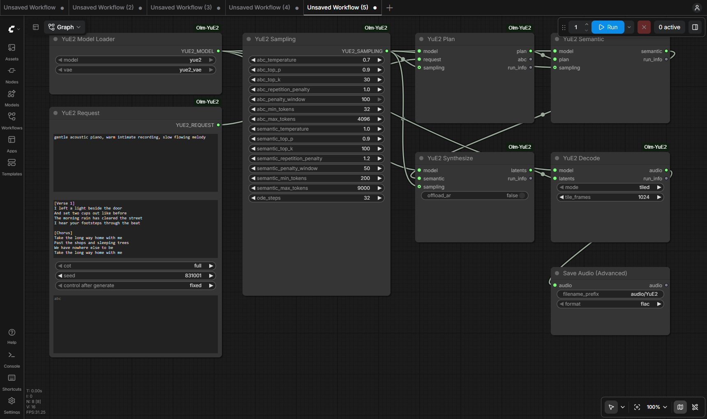
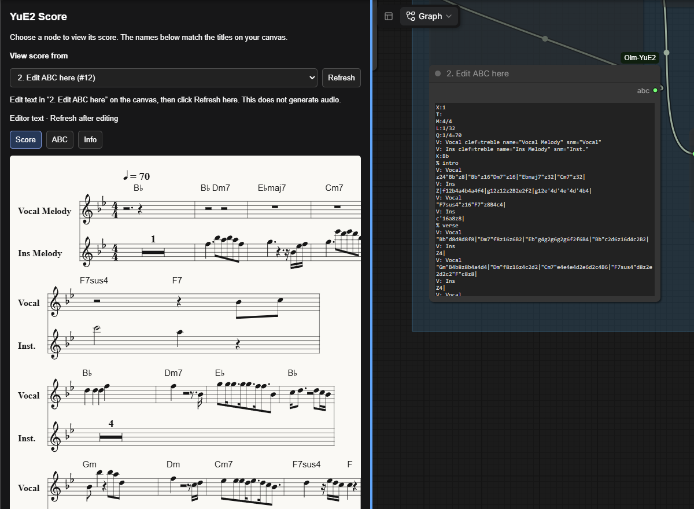

# ComfyUI-Olm-YuE2

Generate songs from a musical style and lyrics in ComfyUI using
[YuE2](https://github.com/multimodal-art-projection/YuE). Optional score viewing
and editing, separate generation stages, and stereo 48 kHz audio output.

Experimental.



## Will my GPU run it?

**Best-effort estimates based on observed memory use.** Only the RTX 5090 has been tested here. For the current unquantized CUDA path on NVIDIA RTX 30 series or newer:

| VRAM | Example desktop GPUs | Rough expectation |
| --- | --- | --- |
| 8 GB or less | RTX 4060 | Unlikely to fit a complete song with the current implementation. |
| 12 GB | RTX 4070 | Very tight; short runs with offloading may fit, but expect out-of-memory failures. |
| 16 GB | RTX 4060 Ti **16 GB**, RTX 4080 | Plausible for shorter songs; try `offload_ar`. Longer songs may exceed capacity. |
| 24 GB | RTX 3090, RTX 4090 | More room for longer songs; offloading may still be needed. |
| 32 GB | RTX 5090 | Tested with complete songs over five minutes. Still workload-dependent. |

[VRAM measurements and offloading tips](docs/vram.md)

## Install

1. Clone or extract this repository into `ComfyUI/custom_nodes/ComfyUI-Olm-YuE2`.
2. From this project folder, install using **ComfyUI's Python**:

   ```text
   python -m pip install -r requirements.txt
   ```

   Windows portable, from the portable installation folder:

   ```text
   python_embeded\python.exe -m pip install -r ComfyUI\custom_nodes\ComfyUI-Olm-YuE2\requirements.txt
   ```

3. Download the models below, restart ComfyUI and refresh the browser.

Reuses ComfyUI's Torch and Transformers. Extra dependencies: `tiktoken` and `accelerate`.

## Models

Download these files; the full repositories are not needed.

| Model | Required files | Put them in |
| --- | --- | --- |
| [YuE2-3B](https://huggingface.co/m-a-p/YuE2-3B/tree/main) | `model.safetensors`, `config.json`, `qwen.tiktoken` | `ComfyUI/models/yue2/` |
| [YuE2-Vae](https://huggingface.co/m-a-p/YuE2-Vae/tree/main) | `model.safetensors`, `config.json` | `ComfyUI/models/yue2_vae/` |

Place the files directly in these folders. The examples select `yue2` and `yue2_vae`.
Other checkpoint folders are supported; select their names from the dropdowns.

For models stored elsewhere, add paths to `extra_model_paths.yaml`:

```yaml
music:
  # Folders containing the files above. Restart ComfyUI after editing.
  yue2: /path/to/models/yue2
  yue2_vae: /path/to/models/yue2_vae
```

## Your first song

1. Open [03_yue2_staged.json](example_workflows/03_yue2_staged.json) in ComfyUI.
2. Select both models from the **YuE2 Model Loader** dropdowns; the example's saved names may differ from yours.
3. In **YuE2 Request**, enter a musical style and the words to sing in **Lyrics**.
4. Keep the sampling defaults and click **Run**.

- The example includes English lyrics to get you started.
- Stages report progress in the console. Generation can take several minutes.
- Audio is saved as FLAC in `ComfyUI/output/audio/`.
- Synthesis uses the most VRAM; models are released after each stage.

[More workflows](example_workflows/README.md) · [Generation stages](docs/staged_workflow.md)

## Optional score tools

- Enable **Settings → YuE2 → Enable optional score tools**.
- Open **YuE2 Score** in the sidebar to view notation or ABC text.
- Try [07_score_inspector.json](example_workflows/07_score_inspector.json): generate a plan, copy it into the editor, then edit and continue.
- Audio generation starts muted in this example. Follow the workflow note to enable it.



[Score tools guide](docs/frontend.md)

## Help

- **No models listed?** Check the files and path keys above, then restart ComfyUI.
- **Old score displayed?** Check the selected source; new plans do not overwrite editor text.
- **Out of memory?** Try experimental `offload_ar` on **YuE2 Synthesize**. See [VRAM usage](docs/vram.md).
- **Dependency issues?** Run `python compat/diagnostics.py` using ComfyUI's Python to list installed versions.

## Credits

Example song **“The Long Way Home”**: original lyrics by OpenAI Codex; music and vocals generated with YuE2.

Based on [YuE2](https://github.com/multimodal-art-projection/YuE), with [abcjs](https://www.abcjs.net/) for notation.
[YuE2 source and notices](_vendor/NOTICE.md) · [abcjs license](web/dist/abcjs-LICENSE.txt).
Integration code: [License & Terms of Use](LICENSE.txt) (source-available).
Bundled components and model weights have separate terms.

---

**Copyright © 2026 Olli Sorjonen**
